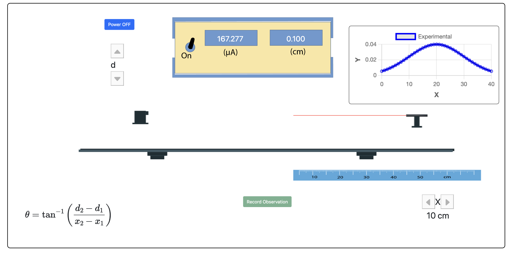
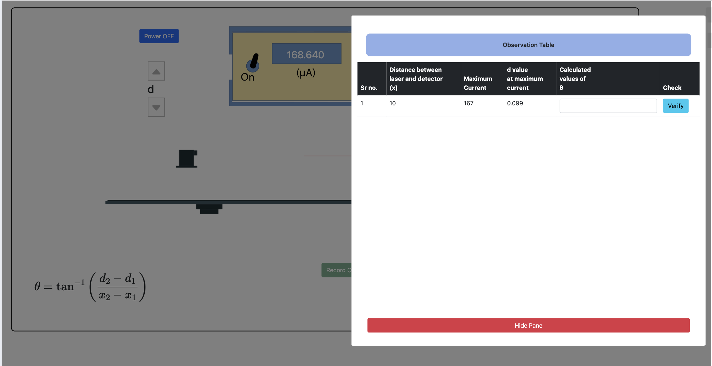

<ol>
<li> Click the start button.  

</li>

<li> start with x = 10 and d = 0. </li>
<li> Vary the d step by step step v
<li> Take the reading when maxima occurs by pressing record observation button  

</li>
<li> After entering values in observation table for first row increase x by 10 </li>
<li> Take readings similarly for x = 10, 20, 30, 40 and 50. </li>

<ol>

